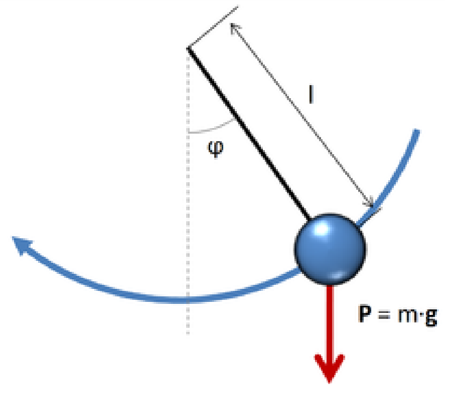



El objetivo en un problema a valores iniciales (PVI) es encontrar una función $y(t)$ dado su valor en un instante inicial $t=0$ y una receta $f(t,y)$ para su pendiente:

$$
\text{(PVI)} \left\{
  \begin{aligned} y' &= f(t,y), \qquad T_0  \le t \le T_f  , \\
    y(T_0 ) &= y_0.
  \end{aligned}
\right.
$$

En algunas aplicaciones se desea graficar una aproximación a $y(t)$ sobre un intervalo de interés $[T_0, T_f]$ para descubrir propiedades cualitativas de la solución. En otras, puede ser importante conocer una estimación precisa del valor $y(t)$ para un tiempo $t=T_f$ prefijado.

Los datos conocidos de (PVI) son: el *valor inicial* $y_0$ y la *función pendiente* $f(t,y)$ que nos dice cuál tiene que ser la pendiente de la solución $y(t)$ en cada instante de tiempo, dependiendo de cuanto vale $y$. Más precisamente:

Se llama *solución de* (PVI) a una función $y(t)$ definida sobre el intervalo $[T_0, T_f]$ que satisface:
$$
y(T_0 ) = y_0, \qquad y'(t) = f(t, y(t)), \quad \text{para todo $t \in [T_0 ,T_f ]$.}
$$

Consideremos por ejemplo el PVI
$$
\left\{ \begin{aligned} y' &=  -2 y, \quad 0 \le t < \infty, \\
y(0) &= 3.
\end{aligned}
\right.
$$

En este caso, el valor inicial es $3$ y la función pendiente es $f(t,y) = -2y$ (es una función de dos variables que en realidad depende de una sola).
La ecuación diferencial $y' = -2 y$ tiene una *familia* de soluciones, son todas las funciones de la forma $y(t) = c e^{-2t}$, con $c$ cualquier constante. La condición inicial $y(0) = 3$ nos dice que queremos hallar la única función de esa familia que en $t=0$ vale 3. Utilizamos la condición inicial para despejar $c$ y nos da que $c=3$. Luego, la solución del PVI es $y(t) = 3 e^{-2t}$.


## Existencia y estabilidad de soluciones {#sec-existencia.y.estabilidad}

Vimos un ejemplo muy sencillo donde hallar la solución fue muy fácil. En general, esto no es tan fácil, como tampoco es obvio que haya solución del problema. A continuación enunciamos una propiedad que nos afirma la existencia de una solución para (PVI).

Si $f$ es una función continua de sus dos variables ($y$ y $t$) y además $\frac{\partial f}{\partial y}$ existe y está acotada, entonces el problema a valores iniciales (PVI) tiene una única solución.

Más aún, si $L \le \frac{\partial f}{\partial y} \le U$ para todo $(y,t)$, resulta lo siguiente:

Si $y$, $\tilde y$ son soluciones de $y' = f(t,y)$ con $y(T_0 )=y_0$ y $\tilde y(T_0 ) = \tilde y_0$, entonces,

$$
|y_0 - \tilde y_0| e^{L(t-T_0 )} \le | y(t) - \tilde y(t) | \le |y_0 - \tilde y_0| e^{U(t-T_0 )}, \qquad \text{para }t \in [T_0  , T_f ].
$$

En palabras, el resultado anterior nos dice que las soluciones del mismo problema, con diferentes condiciones iniciales, *se alejan* al menos tan rápido como $e^{Lt}$ y no más rápido que $e^{Ut}$ por la diferencia entre las condiciones iniciales.

En el ejemplo anterior, $f(t,y) = -2y$, luego $\frac{\partial f}{\partial y} = -2$, y por lo tanto $L=U=-2$. En este caso, tenemos que soluciones del mismo PVI con dos condiciones iniciales diferentes se acercan como $e^{-2t}$ por el *error inicial*. Más precisamente, observemos las soluciones con $y_0 = 3$ y con $\tilde y_0 = 3.1$. En este caso,
$$
y(t) = 3 e^{-2t}, \quad\text{y} \quad \tilde y(t) = 3.1 e^{-2t},
$$

por lo que
$$
|y(t) - \tilde y(t)| = |3 e^{-2t} - 3.1 e^{-2t}| = |3 - 3.1| e^{-2t} = 0.1 e^{-2t}.
$$

:::: {.callout-note}
## Un ejemplo importante.

::: {#nota-sol.no.se.alejan}
Si estamos en un caso en que $\frac{\partial f}{\partial y}\le 0$ entonces $U=0$ y tenemos que
$$
|y(t)-\tilde y(t)| \le | y_0 - \tilde y_0 |,  \qquad \text{para }t \in [T_0  , T_f ].
$$

Es decir, las soluciones *no se alejan*.
:::
::::


## Método de Euler {#sec-metodo.de.euler}

Los métodos que desarrollaremos en el curso producen una sucesión de instantes de tiempo $t_1, t_2, \cdots$, y valores aproximados $Y_1, Y_2, \cdots$, que se espera sean aproximados a $y(t_1), y(t_2), \cdots$.

Todo lo que tenemos a disposición es la *función pendiente* $f(t,y)$, que puede evaluarse cuando sea necesario.

Recordando que la definición de derivada es
$$
y'(t) = \lim_{h \to 0} \frac{y(t+h) - y(t)}h,
$$

resulta, para $h>0$ pequeño,
$$
\frac{y(t+h) - y(t)}h \approx y'(t).
$$

Si $y$ es solución de (PVI) entonces, para un parámetro $h>0$ pequeño,
$$
 \frac{y(t+h) - y(t)}h \approx y'(t) = f(t,y(t)),
$$

es decir
$$
y(t+h) \approx y(t) + h f(t,y(t)).
$$

En palabras, conocido (o aproximado) el valor de $y(t)$, el valor de $y(t+h)$ es aproximadamente $y(t) + h f(t,y(t))$.

El **método de Euler** se basa en esta idea y consiste en lo siguiente:

* Particionar el intervalo $[T_0,T_f]$ en $L$ subintervalos de longitud $h = (T_f-T_0)/L$.
* Definir $t_i = T_0 + (i-1)\, h$, $i=1,2,\dots L+1$.
* Definir $Y_1 = y_0$ ($Y_1 = y(t_1) = y({ T_0})$).
* Para $i=1,2,\dots,L$, definir $Y_{i+1} = Y_i + h f(t_i, Y_i)$.

Es decir:
$$
\begin{aligned}
  t_1 &= T_0 & & Y_1=y_0 \\
  t_2 &= T_0 + h & & Y_2=Y_1 + h \, f(t_1,Y_1) \\
  t_3 &= T_0 + 2h & & Y_3=Y_2 + h \, f(t_2,Y_2) \\
  t_4 &= T_0 + 3h & & Y_4=Y_3 + h \, f(t_3,Y_3) \\
  &\vdots & &\quad \vdots \\
  t_{L+1} &= T_0 + Lh = T_f & & Y_{L+1}=Y_L + h \, f(t_L,Y_L)
\end{aligned}
$$

De esta manera se obtienen $L+1$ números $Y_1, Y_2, Y_3, \cdots, Y_{L+1}$ que se espera aproximen a $y(t_1), y(t_2), y(t_3), \cdots, y(t_{L+1})$.

```{python}
#| title: Solución por el método de Euler a distintos L
#| fig-align: center
#| code-fold: true

import numpy as np
import matplotlib.pyplot as plt

f = lambda t, y: -2*y
#Definimos el intervalo
inter = [0, 4]
#Cantidad de divisiones
L1 = 10
L2 = 20

y0 = 3

t1 = np.linspace(inter[0], inter[1], L1 + 1)
h1 = (inter[1] - inter[0]) / L1
t2 = np.linspace(inter[0], inter[1], L2 + 1)
h2 = (inter[1] - inter[0]) / L2

y1 = np.zeros(L1 + 1)
y2 = np.zeros(L2 + 1)

y1[0], y2[0] = y0, y0

#implementamos el método
for n in range(L1):
  y1[n + 1] = y1[n] + h1 * f(t1[n], y1[n])
for n in range(L2):
  y2[n + 1] = y2[n] + h2 * f(t2[n], y2[n])

# Definimos la solución exacta
y_exacta = lambda t: 3 * np.exp(-2 * t)

# Graficamos las soluciones en dos gráficos distintos, uno al lado del otro
fig, (ax1, ax2) = plt.subplots(1, 2, figsize=(8, 4))

# Gráfico 1: Solución con L = 20
t_fina = np.linspace(inter[0], inter[1])
ax1.plot(t1, y1, label='Euler (L=10)')
ax1.plot(t_fina, y_exacta(t_fina), label='Solución exacta')
ax1.set_title('Solución con L = 10')
ax1.set_xlabel('t')
ax1.set_ylabel('y(t)')
ax1.legend()

# Gráfico 2: Solución con L = 40
ax2.plot(t2, y2, label='Euler (L=20)')
ax2.plot(t_fina, y_exacta(t_fina), label='Solución exacta')
ax2.set_title('Solución con L = 20')
ax2.set_xlabel('t')
ax2.set_ylabel('y(t)')
ax2.legend()

# Ajustar el espaciado entre los gráficos
plt.tight_layout()

# Mostrar los gráficos
plt.show()
```

En las gráficas podemos observar la solución obtenida y la exacta para el ejemplo que venimos trabajando, con $L=10$ y $L=20$ sobre el intervalo $[0,4]$. Vemos en particular como al duplicar la cantidad de intervalos, la solución obtenida se aproxima más a la exacta.

A continuación se define la función `euler1` que tiene una implementación del método de Euler.

```{python}
#| code-fold: false

def euler1(f, inter, y0, L):
  """
  Método de Euler para resolver
  y’ = f(t,y) en [t0,TF]
  y(t0) = y0
  Usando L pasos
  """
  t = np.linspace(inter[0], inter[1], L + 1)
  h = (inter[1] - inter[0]) / L
  # reservamos lugar en memoria para y
  y = np.zeros(L + 1)
  y[0] = y0
  for n in range(L):
    y[n + 1] = y[n] + h * f(t[n], y[n])
  return t, y
```

Es claro que en cada paso se comete un error, pequeño si $h$ es pequeño, pero estos errores de alguna manera se *acumulan*, y para llegar a $T_f $ la cantidad de pasos será mayor cuanto menor sea $h$.

Para entender un poco mejor el error cometido, necesitamos definir algunas cantidades:

**Error global:** Se llama error global al máximo error entre $y(t_n)$ y $Y_n$, es decir,
$$
g_n = | y(t_n) - Y_n|, \qquad \text{error global} = \max\limits_{1\le n \le L+1} g_n = \max\limits_{1\le n \le L+1} |y(t_n)-Y_n|.
$$

**Error local de truncamiento:**
Llamamos $y_j$ a las soluciones de $y'= f(t,y)$ que pasan por $(t_j,Y_j)$, más precisamente, comienzan en $t_j$ y cumplen la condición inicial $y_j(t_j) = Y_j$, es decir,
$$
\left\{
  \begin{aligned} y_j' &= f(t,y_j), \qquad t_j \le t \le T_f , \\
    y_{j}(t_j) &= Y_j.
  \end{aligned}
\right.
$$

Notemos que, bajo esta definición, $y(t) = y_1(t)$. Entonces
$$
\text{error local de truncamiento} = \varepsilon_j = |y_j(t_{j+1}) - Y_{j+1}|,
$$

es decir, el error local de truncamiento $\varepsilon_j$ es el error que se comete en el paso $j$, suponiendo que no había error acumulado. Notar que el error global es $g_j = |y_1(t_j) - Y_j|$ (siempre compara con $y(t) = y_1(t)$).

Ahora sí estamos en condiciones de hacer el análisis del error global. Para fijar ideas, supongamos que $\frac{\partial f}{\partial y} \le 0$ de manera que las *trayectorias no se alejan* (ver [Nota](#nota-sol.no.se.alejan){.quarto-xref}), más precisamente, si $t \ge t_{j+1}$,
$$
| y_j(t) - y_{j+1}(t) | \le |y_j(t_{j+1}) - y_{j+1}(t_{j+1})|
= |y_j(t_{j+1}) - Y_{j+1}| = \varepsilon_j.
$$

Entonces
$$
\begin{aligned}
g_n &= |Y_n - y(t_n)| = |Y_n - y_1(t_n)| \\
&\le |Y_n - y_{n-1}(t_n)| + |y_{n-1}(t_n) - y_{n-2}(t_n)|
+ \dots + |y_2(t_n) - y_1(t_n)| \\
&\le \varepsilon_{n-1} + \varepsilon_{n-2} + \dots + \varepsilon_1 = \sum_{j=1}^{n-1} \varepsilon_j.
\end{aligned}
$$

Por lo tanto, el máximo error global puede acotarse por
$$
\max\limits_{1\le n \le L+1} g_n \le \max\limits_{1\le n \le L+1} \sum_{j=1}^{n-1} \varepsilon_j
= \sum_{j=1}^{L} \varepsilon_j
\le L \max\limits_{1\le j \le L} \varepsilon_j.
$$ {#eq-maximo.error.global}

Hasta aquí , el análisis que hemos hecho es independiente del método, si es Euler o algún otro. Veamos cómo se puede acotar $\varepsilon_j$ para el método de Euler.

Una herramienta muy utilizada para estimar y acotar el error en los métodos numéricos es el Teorema de Taylor, que enunciamos a continuación:

:::: {.callout-warning icon="false"}
## Teorema de Taylor

::: {#thm-PVI.para.sistemas.v1}
Sea $y \in C^{n+1}(I)$, donde $I$ es un intervalo que contiene a $t_0$. Entonces, para cada $t \in I$ existe $x$ entre $t_0$ y $t$ tal que
$$
y(t) = y(t_0) + (t-t_0) y'(t_0) + \frac{(t-t_0)^2}{2!} y''(t_0) + \dots +
  \frac{(t-t_0)^n}{n!} y^{(n)}(t_0) + \frac{(t-t_0)^{n+1}}{(n+1)!} y^{(n+1)}(x).
$$
:::

::::

Usando el teorema de Taylor y considerando que $h = \frac{T_f-T_0}L$ y que $t_{j+1} = t_j+h$, tenemos
$$
y_j(t_{j+1}) = y_j(t_j) + h y_j'(t_j) + \frac{h^2}2 y_j''(\xi_j)
=\underbrace{ Y_j + h f(t_j,Y_j) }_{Y_{j+1}} + \frac{h^2}2 y_j''(x_j)
$$

para algún $x_j$, con $t_j < x_j < t_{j+1}$. Por lo tanto,
$$
\varepsilon_j = | y_j(t_{j+1}) - Y_{j+1} | = | y_j(t_{j+1}) -
[ Y_j + h f(t_j,Y_j)] | = \frac{h^2}2 |y_j''(x_j)|
$$

y si existe $M>0$ tal que $\max\limits_{T_0\le t \le T_f} |y_j''(t)| \le M$, $j=1,\dots,L$, entonces
$$
\varepsilon_j \le \frac{M h^2}2, \quad j=1,2,\dots,L.
$$

Finalmente, acotamos el error global usando -@eq-maximo.error.global:
$$
\max\limits_{1\le n \le L} |Y_n - y(t_n)| \le L \max\limits_{1\le j \le L} \varepsilon_j
\le L \frac{M h^2}2 = \underbrace{Lh}_{T_f-T_0} \frac{Mh}2 = \frac{M (T_f-T_0)}2 h .
$$

::: {.callout}
Concluimos entonces que si todas las soluciones de la EDO tienen derivada segunda acotada uniformemente por $M$, el método de Euler produce una solución con máximo error acotado por $\frac{M (T_f-T_0)}2 h = \text{Const.} \times h$. Se dice que el método de Euler es de orden uno (la potencia de $h$).

La demostración que hemos visto es muy simple, y analizando el caso $\frac{\partial f}{\partial y} \le 0$, permite entender la idea general que si un método produce en un paso un error de orden $h^{k+1}$ entonces el error global será de orden $h^k$.
:::

### Pongámonos a prueba!!! 💪🏻

Intentá hallar la solución a los siguientes problemas con los conocimientos adquiridos en esta sección.

Recordá que si bien estás buscando un resultado en particular, herramientas como gráficas u otros cálculos auxiliares pueden ser de mucha ayuda para llegar a este.

Podés resolver utilizando la celda de código dispuesta luego de los ejercicios en este mismo apunte, o corriendo python de manera local.

:::: {.callout-tip icon="false" collapse="false"}
## 📝 Ejercicio Euler 1

::: {}
Considere el método de Euler para resolver el siguiente PVI:

$$
\text{} \left\{
  \begin{aligned} y' &= -y, \qquad 0  \le t \le 1  , \\
    y(0 ) &= 1.
  \end{aligned}
\right.
$$

1. Obtenga el valor $y(1)$ con una precisión de 4 dígitos decimales. (Si se empieza con $L = 10$, indique cuántas duplicaciones de $L$ son necesarias para llegar a la precisión deseada).

2. ¿Cuánto vale $y(t)$ para $t = 0.687$? De su resultado con 3 decimales exactos.

3. Sabiendo que este PVI tiene solución exacta $y(t) = e^{−t}$, complete la siguiente tabla:

  |L|h| $E_L$ | $\frac{E_{L/2}}{E_L}$ |
  |-|-|-|-|
  |10|0.1| | |
  |20|0.05| | |
  |40|0.025| | |
  |80|0.0125| | |
  |160|0.00625| | |
  |320|0.003125| | |
  |640|0.0015625| | |
  |1280|0.00078125| | |

  Aquí, el error global con $L$ pasos es $E_L = \max\limits_{1≤i≤L+1}|y(t_i)-Y_i|$. Si el método está bien implementado, debería ocurrir que el error global se divide aproximadamente a la mitad cuando se duplica la cantidad de pasos.

*Sugerencia: para armar una tabla a partir de vectores, explore la función ```DataFrame``` de la librería ```pandas```.*
:::

```{pyodide-python}
# Use esta celda sólo en caso de no disponer de Spyder en este momento


```
::::

:::: {.callout-tip icon="false" collapse="true"}
## 📝 Ejercicio Euler 2

::: {}
Considere el PVI
$$
\text{} \left\{
  \begin{aligned} y' &= f(t,y) = -\cos(2\pi t^2) - t y , \qquad 0  \le t \le 4  , \\
    y(0 ) &= 2.
  \end{aligned}
\right.
$$

1. Resuelva con el método de Euler. Utilice diferentes valores de $L$ (por ejemplo: 10, 20, 40, 80, 160, $\cdots$ ) y grafique las aproximaciones de la solución que se van obteniendo. Determine un valor de $L$ para el que la
aproximación obtenida visualmente coincide con la solución del problema.

2. Calcule el máximo y el mínimo de la solución del PVI en el intervalo $[0, 4]$. Obtenga los valores de $t$ donde éstos se alcanzan.

3. Encuentre el valor aproximado de $t$ para el cual $y(t) = 1$.

4. Calcule ahora las tres soluciones de la misma ecuación diferencial pero con condición inicial $y(0) = 1$, $y(0) = 0$ y $y(0) = -1$, respectivamente. Grafíquelas todas sobre el mismo par de ejes y diga que ocurre a medida que el tiempo $t$ avanza. ¿Se acercan o se alejan las trayectorias? ¿Cómo se relaciona esto con $\frac{\partial f}{\partial y}$ ?
:::

```{pyodide-python}
# Use esta celda sólo en caso de no disponer de Spyder en este momento


```
::::

:::: {.callout-tip icon="false" collapse="true"}
## 📝 Ejercicio Euler 3

::: {}
Considere el PVI
$$
\text{} \left\{
  \begin{aligned} y' &= f(t,y) = y(1-y)(1+y) , \qquad 0  \le t \le 2  , \\
    y(0 ) &= y_0.
  \end{aligned}
\right.
$$

1. Utilice el método de Euler con $L = 10000$ pasos para resolver el PVI con $y_0 = -1.4, -1.3, -1.2, \cdots , 1.3, 1.4$.
Superponga todas las soluciones en un gráfico y explique el comportamiento cualitativo de las soluciones.

2. Divida el plano $(t, y)$ en zonas donde $\frac{\partial f}{\partial y}$ tenga distinto signo. Utilice estas zonas para justificar, mediante la teoría, lo observado anteriormente.
:::

```{pyodide-python}
# Use esta celda sólo en caso de no disponer de Spyder en este momento


```
::::

:::: {.callout-tip icon="false" collapse="true"}
## 📝 Ejercicio Euler 4

::: {}
La radiación y(t) de cierta partícula a tiempo $t$ está gobernada por la ecuación diferencial $y' = 1 - t^2 \sin (y)$. La medición del estado inicial (a tiempo $t=0$) indica que $y(0) = 1.57$,

1. Encuentre el estado de la radiación y a tiempo $t = 5$, con error absoluto menor a $10^{-6}$.

2. Encuentre el o los instantes en que la radiación toma el valor $2$.

3. A partir del tiempo $t = 5$, la radiación cambia abruptamente de comportamiento, observándose que la ecuación diferencial que la gobierna ahora es $y' = 1 + y$. ¿Cuanto valdrá la radiación a tiempo $t = 10$?
:::

```{pyodide-python}
# Use esta celda sólo en caso de no disponer de Spyder en este momento


```
::::


## PVI para sistemas de ecuaciones y ecuaciones de orden superior {#sec-PVI.para.sistemas}

Consideremos ahora un *sistema* de ecuaciones diferenciales ordinarias. Por ejemplo, un modelo de predador presa:
$$
\left\{
\begin{aligned}
x_1' &= 0.5 x_1 + 0.2 x_1 x_2 \\
x_2' &= 0.8 x_2 - 0.8 x_1 x_2
\end{aligned}
\right.
\qquad
\begin{aligned}
x_1(0) &= 500\\
x_2(0) &= 10000
\end{aligned}
$$

Para resolverlo numéricamente, primero lo transformamos en una ecuación diferencial ordinaria *vectorial*. Definimos
$$
x(t) = \begin{bmatrix} x_1(t) \\ x_2(t) \end{bmatrix}
\qquad
x' =  \begin{bmatrix} x_1' \\ x_2' \end{bmatrix} = \begin{bmatrix} 0.5 x_1 + 0.2 x_1 x_2 \\ 0.8 x_2 - 0.8 x_1 x_2 \end{bmatrix}
\qquad
x(0) =  \begin{bmatrix} x_1(0) \\ x_2(0) \end{bmatrix}  =  \begin{bmatrix} 500 \\ 10000 \end{bmatrix}
$$

El PVI entonces resulta:
$$
\begin{cases}
\begin{aligned}
  x' &= \begin{bmatrix}
    0.5 x_1 + 0.2 x_1 x_2 \\
    0.8 x_2 - 0.8 x_1 x_2
  \end{bmatrix}
  \\
  x(0) &= \begin{bmatrix}
    500 \\
    10000
  \end{bmatrix}
\end{aligned}
\end{cases}
$$

Un PVI para un sistema de ecuaciones diferenciales ordinarias es un problema de la forma:
$$
\begin{cases}
\begin{aligned}
  y' &= f(t,y) \qquad T_0 \le t \le T_f \\
  y(T_0) &= y_0
\end{aligned}
\end{cases}
$$ {#eq-pvi.sistema.ecuaciones}

donde $y_0 \in \mathbb{R}^n$ ($y_0$ es un vector) y $f:[T_0,T_f]\times\mathbb{R}^n \to \mathbb{R}^n$, es decir, $f$ es una función vectorial de dos variables, la primera ($t$) es escalar, y la segunda ($y$) es vectorial.

Con respecto a la existencia y unicidad de soluciones de -@eq-pvi.sistema.ecuaciones, tenemos el siguiente teorema:

:::: {.callout-warning icon="false"}
## Existencia y unicidad de soluciones

::: {#thm-PVI.para.sistemas.v2}
Si $f:[T_0,T_f]\times\mathbb{R}^n \to \mathbb{R}^n$ es continua de sus dos variables $(t,y)$ y $\frac{\partial f_i} {\partial y_j}$ es continua, con $\left| \frac{\partial f_i}{\partial y_j} \right| \le M$, entonces el problema -@eq-pvi.sistema.ecuaciones tiene solución única.
:::
::::

### Ejemplo (Péndulo ideal)
Si consideramos un péndulo de brazo rígido de longitud $\ell$,
donde no hay fricción ni resistencia del aire, el ángulo $\varphi(t)$
que forma el péndulo con la vertical satisface la siguiente ecuación
diferencial:
$$
\varphi''(t) = - \frac g\ell \sin \varphi(t)
$$

donde $g$ denota la constante de aceleración gravitacional. Esta es una ecuación diferencial ordinaria de orden dos, pues aparecen derivadas segundas de la incógnita $\varphi$.

{fig-align="center" width=300px}

Este problema resulta un PVI cuando se complementa con dos condiciones iniciales:
$$
\varphi(0) = \varphi_0,\qquad
\varphi'(0) = v_0,
$$

donde $\varphi_0$ denota el desplazamiento angular inicial (dato) y $v_0$ la velocidad angular inicial (dato).

Para resolver este PVI en la computadora, primero lo transformamos en un *sistema* de ecuaciones diferenciales de *primer* orden, de la siguiente manera:

Definimos
$$
\begin{aligned}
  y_1 &= \varphi
  \\
  y_2 &= \varphi'
\end{aligned}
$$

de manera que
$$
\begin{aligned}
  y_1' &= \varphi' = y_2
  \\
  y_2' &= \varphi'' = -\frac g\ell \sin \varphi = -\frac g\ell \sin y_1,
\end{aligned}
$$

y
$$
y_1(0) = \varphi(0) = \varphi_0, \qquad y_2(0) = \varphi'(0) = v_0.
$$

Ahora reescribimos las ecuaciones en términos de $y_1$, $y_2$ sin usar $\varphi$, $\varphi'$:
$$
\begin{cases}
\begin{aligned}
  y_1' &= y_2
  \\
  y_2' &= -\frac gL \sin y_1,
\end{aligned}
\end{cases}
\qquad
\begin{cases}
\begin{aligned}
  y_1(0) = \varphi_0,\\
  y_2(0) = v_0.
\end{aligned}
\end{cases}
$$

Si llamamos $y = \begin{bmatrix}y_1\\y_2\end{bmatrix}$ resulta
$$
y' = \begin{bmatrix} y_2 \\ -\frac gL \sin y_1 \end{bmatrix}
\qquad
y(0) = \begin{bmatrix} \varphi_0 \\ v_0 \end{bmatrix}.
$$

Presentamos a continuación una modificación del código de la función `euler1` que sirve también para resolver PVI para sistemas de ecuaciones diferenciales.
La función está diseñada con el siguiente formato:
$$
\texttt{t, y = euler(f, [T0, TF], y0, L)}
$$

$\textbf{Entradas:}$

* `f=f(t,y)`: Es una función que recibe dos argumentos, `t` es un escalar, `y` es un vector *columna* de `n` componentes; y retorna un vector columna de `n` componentes, siendo `n=len(y0)`. Por ejemplo: `f = lambda t,y: np.array([-t * y[1], t * (y[0]-y[1])])`.
* `[T0, TF]`: Es un vector de dos componentes que indican el intervalo donde se desea conocer la solución.
* `y0`: Es un vector columna que indica el *dato inicial*.
* `L`: Es un número que indica la cantidad de sub-intervalos en que se divide el intervalo `[T0, TF]` para resolver por el método de Euler.

$\textbf{Salidas:}$

* `t`: Debe ser un vector columna de `L+1` componentes.
* `y`: Debe ser una matriz de `L+1` filas y `n` columnas. La `i`-ésima fila debe contener el estado `y` a tiempo `t(i)`.

```{python}
#| code-fold: false

def euler(f, inter, y0, L):
  """
  Método de Euler para resolver
  y’ = f(t,y) en [t0,TF]
  y(t0) = y0
  Usando L pasos
  y0 puede ser vectorial o escalar
  """
  t = np.linspace(inter[0], inter[1], L + 1)
  h = (inter[1] - inter[0]) / L
  # reservamos lugar en memoria para y
  y = np.zeros((len(y0), L + 1))
  y[:, 0] = y0
  for n in range(L):
    y[:, n + 1] = y[:, n] + h * f(t[n], y[:, n])
  return t, y.T
```


